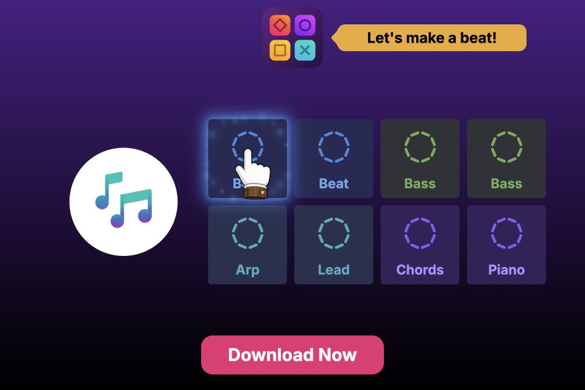
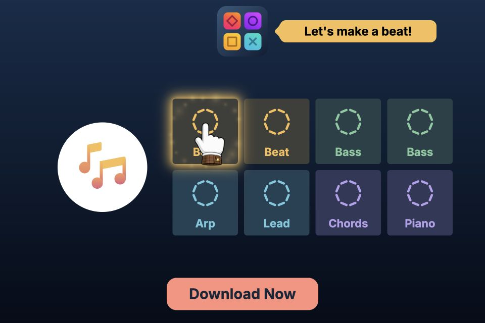

# Music Mixer Playable

**One codebase. Multiple music packs, tutorial flows, themes, languages, and ad networks.**

A playable music mixer built with [Replayable](https://github.com/replayablejs/replayable)
and HTML/CSS/TSX. The gameplay is shared across every variation: change configuration
and assets to produce a different creative without copying the project.

[Browse previews & download exports](https://replayablejs.github.io/music-mixer-playable/)

| Music pack  | Guided introduction                                                                                    | Full mixer immediately                                                                                                |
| ----------- | ------------------------------------------------------------------------------------------------------ | --------------------------------------------------------------------------------------------------------------------- |
| Liquid DnB  | [Play guided](https://replayablejs.github.io/music-mixer-playable/exports/preview_liquiddnb_en.html)   | [Play free play](https://replayablejs.github.io/music-mixer-playable/exports/preview_liquiddnb_no_tutorial_en.html)   |
| First Light | [Play guided](https://replayablejs.github.io/music-mixer-playable/exports/preview_first_light_en.html) | [Play free play](https://replayablejs.github.io/music-mixer-playable/exports/preview_first_light_no_tutorial_en.html) |

These links open English previews. The catalog includes French and Italian too.

_Public links will become available after the first GitHub Pages deployment._

| Liquid DnB                                                    | First Light                                                                            |
| ------------------------------------------------------------- | -------------------------------------------------------------------------------------- |
|  |                |
| Drum-and-bass loops with purple and pink visuals.             | Original synthesized loops at 128 BPM in A minor, with navy, amber, and coral visuals. |

## One source, only the assets each variation needs

Both music packs live in this repository, but **neither pack’s audio is included in
the other pack’s build**. Players download only the music used by their variation.

This is handled automatically by Replayable’s asset pipeline, using the exclusion
rules in [config/versions.ts](config/versions.ts). For example, the Liquid DnB pair:

```ts
export default {
  liquiddnb: {
    params: { soundPack: 'liquiddnb', tutorial: true },
    assets: { exclude: ['sounds/firstlight_*'] },
  },
  'liquiddnb-no-tutorial': {
    params: { soundPack: 'liquiddnb', tutorial: false },
    assets: {
      exclude: ['sounds/firstlight_*', 'sprites/thumbs-up-spritesheet.png'],
    },
  },
  // First Light has the same guided/free-play pair,
  // excluding sounds/liquiddnb_* instead.
};
```

The [`soundPack` parameter](config/params.ts) selects the music mapping, timing, and CSS theme. Replayable
applies the corresponding asset rules during the build; there is no manual file
copying or separate project to maintain. Keep the parameter and exclusions paired
when adding another pack.

The same approach extends to more creative variations. Add their configuration,
assets, and any behavior they need while keeping the shared gameplay in one place.
Replayable builds the configured combinations of **version × language × network**.

This project currently produces:

- **[4 versions](config/versions.ts):** Liquid DnB and First Light, each with tutorial on or off.
- **[3 languages](config/localization.ts):** English, French, and Italian, including localized hand artwork.
- **[8 network profiles](config/networks.ts):** Preview, AppLovin, Meta, Google, Liftoff, Mintegral, Moloco, and Unity.
- **96 exports**, including twelve standalone browser previews.

The catalog automatically lists the generated files, their formats, and sizes.
Download an HTML or ZIP export for testing or production delivery to its network.

## Localized artwork, resized automatically

Localization applies to images as well as text. These three source files represent
one logical asset, `hand`:

| English / fallback                                                                      | French                                                                                    | Italian                                                                                    |
| --------------------------------------------------------------------------------------- | ----------------------------------------------------------------------------------------- | ------------------------------------------------------------------------------------------ |
|  |  |  |
| `hand.png`                                                                              | `hand.fr.png`                                                                             | `hand.it.png`                                                                              |

Using the language and fallback settings in [config/localization.ts](config/localization.ts),
Replayable selects the matching artwork **at build time**: French builds use
`hand.fr.png`, Italian builds use `hand.it.png`, and English uses the unsuffixed
fallback, `hand.png`. Each build includes its selected hand, rather than all three.
Gameplay always accesses `sprites.hand`; it needs no language-specific image logic.

Every source image is **1254 × 1254 pixels**. This excerpt from
[config/assets.ts](config/assets.ts) shows the rule that resizes the selected artwork
to **128 × 128 pixels** in the generated assets:

```ts
export default {
  assets: {
    sprites: [
      {},
      {
        match: 'hand{,.*}.png',
        options: { scale: 128 / 1254 },
      },
    ],
  },
};
```

Keep the high-resolution originals in the repository; Replayable handles language
selection, resizing, and output encoding during the build. The delivered image is
128 × 128; its on-screen size still follows the responsive layout.

## Two bundles, shared by every version

[config/assets.ts](config/assets.ts) defines one loading split for all four versions:

| Bundle    | Contents                                                              | Loading                                                 |
| --------- | --------------------------------------------------------------------- | ------------------------------------------------------- |
| Primary   | Eight compact-pad sounds, localized hand artwork, font, and text      | Loaded by `playable.ready()` before the scene appears.  |
| Secondary | Sixteen remaining sounds, plus the thumbs-up sheet in guided versions | Loading starts unconditionally after the scene appears. |

**Guided versions** start with eight pads, teach the mixer, play the thumbs-up
celebration, then expand to all 24 pads. **Free-play versions** show all 24 pads
immediately, skip the tutorial and celebration, and exclude the thumbs-up asset
from the export. Idle hints remain available in both, controlled by [config/params.ts](config/params.ts).

The loading split is shared: free play still loads eight sounds in primary and
sixteen in secondary. There are no extra waits before interaction or expansion.
Secondary defers runtime loading and decoding; its bytes are still included in a
standalone export. Asset exclusion, by contrast, removes the unused asset entirely.

## What else this demonstrates

- Shared mixer logic, grouped pad selection, synchronized loops, and one-shot FX.
- Responsive portrait and landscape layouts using Replayable’s [screen configuration](config/screen.ts) and safe-area data.
- Tutorial, idle hints, speaker pulses, particles, and success/timeout endcards.
- Runtime-managed audio unlock, mute, visibility, timers, and animation lifecycle.
- Localized text and image assets, plus themes supplied through CSS variables.

The selected mix continues through the endcard. Each pack has 20 loops and four
one-shot effects. First Light’s choir sounds are synthesized vowel textures.

## Run locally

Requires Node.js 24+ and pnpm 10.32.1. Replayable packages are pinned to the published
`0.1.0-alpha.4` release; no toolkit checkout is required. The local catalog and
export preview commands also require Python 3.

```sh
pnpm install --frozen-lockfile
pnpm dev:liquiddnb
# Or:
pnpm dev:first-light
# Start directly with the full mixer:
pnpm dev:liquiddnb:no-tutorial
pnpm dev:first-light:no-tutorial
```

`pnpm dev` starts the default version. The root
[replayable.config.ts](replayable.config.ts) composes these typed configuration sections:

| Configuration                             | Controls                                                                 |
| ----------------------------------------- | ------------------------------------------------------------------------ |
| [assets.ts](config/assets.ts)             | Source assets, processing, resizing, and primary/secondary bundles.      |
| [versions.ts](config/versions.ts)         | Music-pack and tutorial combinations, with per-version asset exclusions. |
| [params.ts](config/params.ts)             | Music-pack selection, tutorial, and idle-hint defaults.                  |
| [localization.ts](config/localization.ts) | Languages and fallback language for text and artwork.                    |
| [networks.ts](config/networks.ts)         | Delivery networks included in builds and exports.                        |
| [screen.ts](config/screen.ts)             | Portrait/landscape dimensions, aspect ratios, and resolution.            |
| [completion.ts](config/completion.ts)     | Duration and inactivity completion timers.                               |
| [controls.ts](config/controls.ts)         | Persistent CTA visibility.                                               |
| [devtools.ts](config/devtools.ts)         | Runtime statistics and development controls.                             |
| [store.ts](config/store.ts)               | Android and iOS destinations for store buttons.                          |

## Build the catalog and exports

Stop the development server first; development and production share generated asset paths.

```sh
pnpm build
pnpm catalog
pnpm catalog:preview
```

Open [the local catalog](http://127.0.0.1:4176/). Its twelve preview links and 96 download
links are generated from Replayable’s public export results, not a handwritten file list.

- `dist/`: built playable variants.
- `exports/`: network-specific HTML and ZIP delivery files.
- `.site/`: the complete deployable catalog, stylesheet, and downloadable exports.

`pnpm catalog` exports existing builds and generates `.site/`. Missing builds or
export validation errors stop generation. To export without the catalog, run
`pnpm export`; `pnpm preview` serves those files at `http://127.0.0.1:4174/`.

Catalog descriptions live in [scripts/catalog/packs.mts](scripts/catalog/packs.mts); HTML is rendered with
`hastscript` and `hast-util-to-html`, the same libraries used by Replayable.

Store buttons currently open Unity’s Creative Testing app, matching Replayable’s
basic examples. Set your own app’s URLs in [config/store.ts](config/store.ts) before
running a campaign. Browser previews do not reproduce an ad host’s environment;
verify delivery in the target network.

## CI and deployment

[The GitHub Actions workflow](.github/workflows/ci.yml) runs on pull requests,
pushes to `main`, and manual runs. It installs locked dependencies, builds all
configured variants, checks formatting/lint/types, and exports the catalog on
Linux, Windows, and macOS. Each operating system runs independently so a failure
on one does not cancel the others.
Building comes before type checking because the asset registries are generated.

Once all three operating systems pass, successful pushes to `main` deploy the
Linux-generated `.site/` to GitHub Pages. A manual run from
`main` also deploys; pull requests and manual runs from other branches only validate.
The deployed site includes the catalog, every browser preview, and every downloadable
network export. Adding versions, languages, or networks requires no workflow changes.

For the first deployment, create the repository and select **Settings → Pages →
Build and deployment → Source → GitHub Actions**. Push this project to `main`.
No deployment secret is needed; the workflow uses GitHub's built-in token with
Pages permissions limited to the deployment job.

## Development checks

```sh
pnpm check       # Formatting, lint, and type checking
pnpm format     # Apply formatting
pnpm lint:fix   # Apply available lint fixes
```

Installing dependencies sets up Husky. Before each commit, lint-staged formats staged
files and checks JavaScript/TypeScript with Oxlint. VS Code recommendations and
workspace settings provide formatting and lint fixes on save.

## Project structure

- [config/](config/): typed Replayable configuration sections.
- `src/main.ts`: asset readiness and scene mounting.
- `src/model/`: selection and success rules.
- `src/scene/`: gameplay, interface, themes, and endcards.
- `src/features/`: mixer, audio, guidance, and artwork components.
- `src/types/`: shared TypeScript contracts.
- `assets/`: source assets; `src/assets/` is generated by Replayable.
- `scripts/catalog/`: catalog rendering, descriptions, and styling.
- `readme/`: screenshots used above.

## Work on Replayable locally

For contributors developing the toolkit alongside this example, stop the development
server and install the toolkit checkout’s pnpm dependencies first.

```sh
pnpm replayable:local connect ../replayable
pnpm replayable:local refresh
pnpm replayable:local restore
```

The helper builds and packs local packages, then installs them temporarily. Restore
published dependencies before committing dependency files. Run
`pnpm replayable:local --help` for more options.

## Asset rights

See [asset rights](assets/NOTICE.md) before redistributing bundled media.
